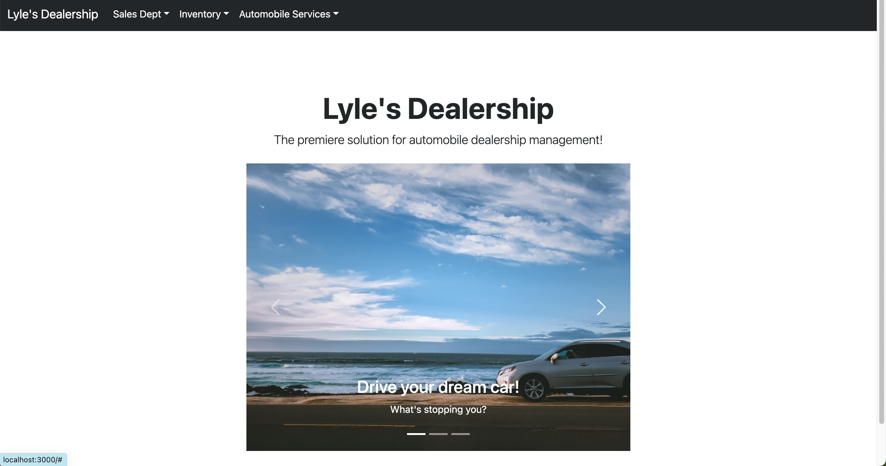

# Lyle's Dealership

# App Overview

This application is ideal for a dealership that is looking to keep all of their information in a convenient database. For the Sales microservice you can add sales reps and customers. You can then see a list of the vehicles the rep has sold and the vehicle that the customer has bought. In the Services microservice, you can add technicians and request an appointment for your car. In the service list you can complete or cancel an appointment, and it also lets the technician know if the customer is a VIP via the vin number. The Inventory microservice can add a manufacturer, and from there you can create a vehicle model, and then show a list of the your complete inventory.

# App Technologies

- Django
- React
- Docker
- RESTful API
- Poller
- PostgreSQL

# Directions for Running Application

- To spin up your Docker containers please run these commands:

  - Run docker volume create beta-data
  - Run docker-compose up

- IMPORTANT FOR AFTER RUNNING DOCKER COMMAND:

  -Open CLI for project-beta-service-api- in docker.

  - RUN: python manage.py createsuperuser
    Fill out necessary info
  - Log into admin http://localhost:8080/admin
  - Click on Status on left side of admin panel.
  - Create 3 instances:

    1. SCHEDULED
    2. CANCELED
    3. COMPLETED

  - Once these three are added feel free the browse the site. To see data you will need to create the data using the forms. How the Inventory API is set up to create a automobile for the sales and service microservices to work, complete these forms in order by click Inventory in nav bar.

    4. Add manufacturer
    5. Add vehicle
    6. Add vehicle to inventory

You can now play around with the microservices! Enjoy :)
